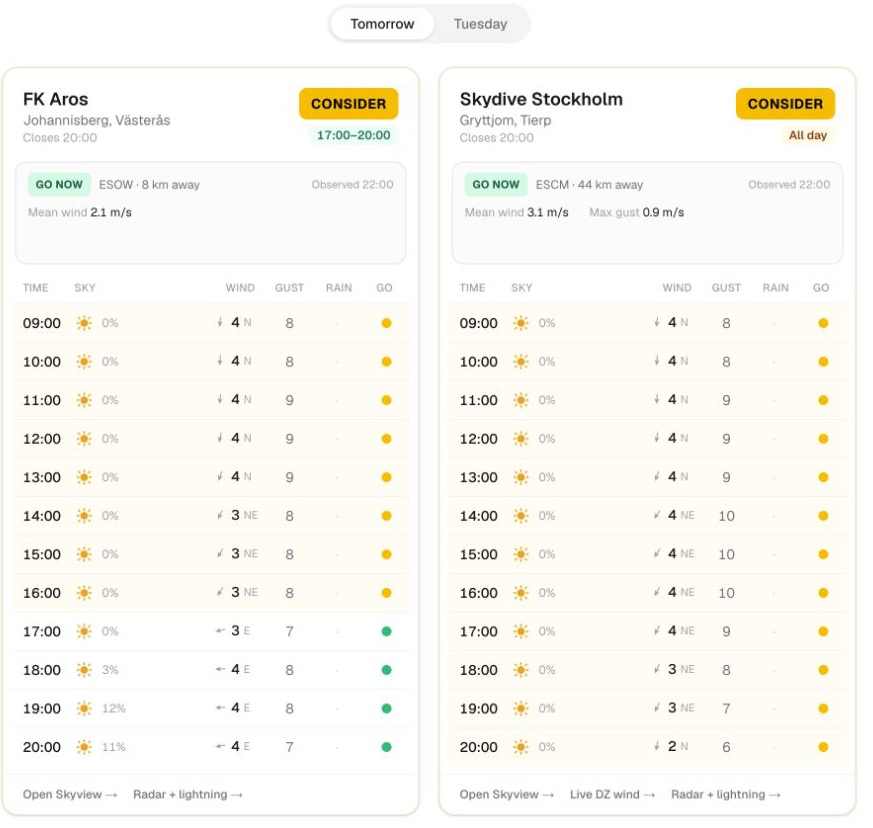

<div align="center">

# 🪂 Let's jump

**Forecast-based GO / CONSIDER / NO-GO for two Swedish dropzones.**

<a href="#quick-start">Quick start</a> ·
<a href="#how-it-works">How it works</a> ·
<a href="https://github.com/d-ismlv/letsjump/pkgs/container/letsjump">Container</a>




</div>

"Should I drive ~70 min to the dropzone?" — one page that turns the forecast into
a **GO / CONSIDER / NO-GO** verdict for **FK Aros** (Västerås) and **Skydive
Stockholm** (Gryttjom), for today and tomorrow. Wind, gusts, rain, cloud and
thunder, scored hour-by-hour over the 09:00–21:00 window.

Forecast only — always confirm actual ops on each club's jump table.

## Quick start

```yaml
# docker-compose.yml
services:
  letsjump:
    image: ghcr.io/d-ismlv/letsjump:latest
    ports: ["32325:32325"]
    restart: unless-stopped
```

```bash
docker compose up -d          # → http://localhost:32325
```

Stateless: nothing to persist, no secrets to set. Or run it locally:

```bash
npm install && npm run dev    # → http://localhost:3000
```

## How it works

Everything runs server-side, in three steps:

1. **Fetch.** Pull the hourly forecast from [Open-Meteo](https://open-meteo.com)
   for each airfield's exact coordinates, using the 1 km MET Nordic model where
   available (the most accurate for Scandinavia).
2. **Score each hour.** Every hour in the 09:00–21:00 window is rated
   go / consider / no-go on the *worst* of five factors: wind, gusts, rain,
   thunder, and cloud.
3. **Roll up the day.** Those hours become one verdict per dropzone, plus the
   best window to jump.

| Verdict | What it means |
|---|---|
| 🟢 **GO** | A solid block of clear hours in the window |
| 🟡 **CONSIDER** | Jumpable but unsettled: showers possible, go early or watch the radar |
| 🔴 **NO-GO** | A real stopper all day |

The hard part is summer storms. A plain forecast can read "0 mm" at the field
while a cell dumps rain a few kilometres away, so the engine also weighs rain
*probability* and atmospheric instability (CAPE), not just millimetres. It also
matches how jumpers actually behave: a shower *chance* only drops a day to
CONSIDER (you jump the holes between clouds), while thunder, steady rain, or a
solid cloud deck are the real NO-GO. All the thresholds live in `LIMITS`
([lib/decision.ts](lib/decision.ts)) and are still being tuned against real jump
days.

<sub>Data © <a href="https://open-meteo.com">Open-Meteo</a> (CC BY 4.0). Not an operational authority — check the radar before driving.</sub>
