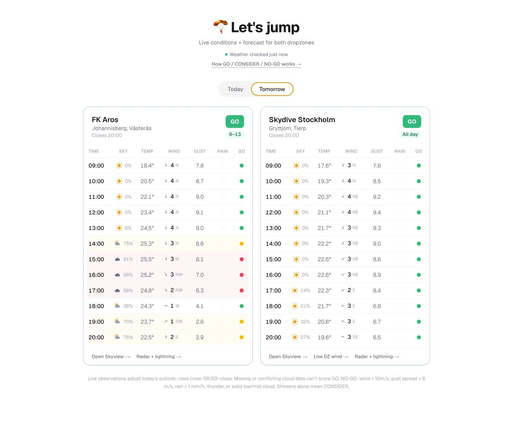

<div align="center">

# 🪂&ensp;Let&apos;s jump

**Live conditions + forecast-based GO / CONSIDER / NO-GO for two Swedish dropzones.**

<a href="#quick-start">Quick start</a> ·
<a href="#how-it-works">How it works</a> ·
<a href="https://github.com/d-ismlv/letsjump/pkgs/container/letsjump">Container</a>




</div>

"Should I drive ~70 min to the dropzone?" — one page that combines current
observations with a **GO / CONSIDER / NO-GO** forecast for **FK Aros** (Västerås) and **Skydive
Stockholm** (Gryttjom), for today and tomorrow. Wind, gusts, rain, cloud and
thunder, scored hour-by-hour over the 09:00–21:00 window.
The current hour prefers available live observations for wind, gust, direction,
and temperature; later hours remain Open-Meteo forecasts. Temperature does not
affect the verdict.

Decision aid only — always confirm actual ops and conditions at the DZ.

## Quick start

```yaml
# docker-compose.yml
services:
  letsjump:
    image: ghcr.io/d-ismlv/letsjump:latest
    ports: ["32325:32325"]
    restart: unless-stopped
```

```bash
docker compose up -d          # → http://localhost:32325
```

Stateless: nothing to persist, no secrets to set. Or run it locally:

```bash
npm install && npm run dev    # → http://localhost:3000
```

## How it works

Everything runs server-side, in four steps:

1. **Observe now.** Pull the latest aviation observation from ESOW for Aros and
   ESCM as regional context for Gryttjom. Gryttjom's public weather page also
   supplies its onsite maximum gust over the last 30 minutes. The source and
   distance are shown, and both cards link to the DZ's live wind page.
2. **Fetch the outlook.** Pull the hourly forecast from
   [Open-Meteo](https://open-meteo.com) for each airfield's coordinates, using
   MET Nordic where available and best-match fields for the rest.
3. **Score each hour.** Every hour from opening until closing is rated
   go / consider / no-go on the *worst* of five factors: wind, gusts, rain,
   thunder, and cloud. Elapsed hours stay visible but muted and are excluded from
   the remaining-day outlook.
4. **Reconcile.** Live wind and gusts replace modeled current-hour values when
   available, and an adverse aviation ceiling can downgrade today's headline.
   Future-day tabs never show or apply current observations.
   Contradictory or incomplete forecast fields never score GO.
   The remaining hours become one outlook per dropzone. A short recoverable wind
   hold does not downgrade an otherwise strong day. Every usable window is
   retained (for example `09–13 · 16–20`); terminal wind starting at least three
   hours before closing is flagged as a likely early stop.

| Verdict | What it means |
|---|---|
| 🟢 **GO** | Live conditions and a solid forecast window are within limits |
| 🟡 **CONSIDER** | Jumpable but unsettled: showers possible, go early or watch the radar |
| 🔴 **NO-GO** | A real stopper all day |

The hard part is summer storms. A plain forecast can read "0 mm" at the field
while a cell dumps rain a few kilometres away, so the engine also weighs rain
*probability* and atmospheric instability (CAPE), not just millimetres. It also
matches how jumpers actually behave: a shower *chance* only drops a day to
CONSIDER (you jump the holes between clouds), while thunder, steady rain, or a
solid cloud deck are the real NO-GO. An unexplained total-cloud/low-cloud
disagreement is marked uncertain instead of silently becoming green. Mean wind
and gust spread are scored separately: exactly 10 m/s mean wind is CONSIDER and
anything above 10 m/s is NO-GO, before the formal 11 m/s operational hold.
Maximum gust remains visible as data; a same-source spread below 7 m/s stays
green, 7–8 m/s is CONSIDER, and above 8 m/s is NO-GO.
The live METAR box also shows the lowest reported cloud base, toggling between
feet and metres. All the thresholds live in `LIMITS`
([lib/decision.ts](lib/decision.ts)) and are still being tuned against real jump
days.

<sub>Forecast data © <a href="https://open-meteo.com">Open-Meteo</a> (CC BY 4.0). Live aviation observations via <a href="https://aviationweather.gov/data/api/">AviationWeather.gov</a>; onsite gust via Skydive Stockholm. Not an operational authority — check Skyview, onsite wind and <a href="https://www.smhi.se/vader/radar-och-satellit/radar-med-blixt">SMHI radar + lightning</a>.</sub>
